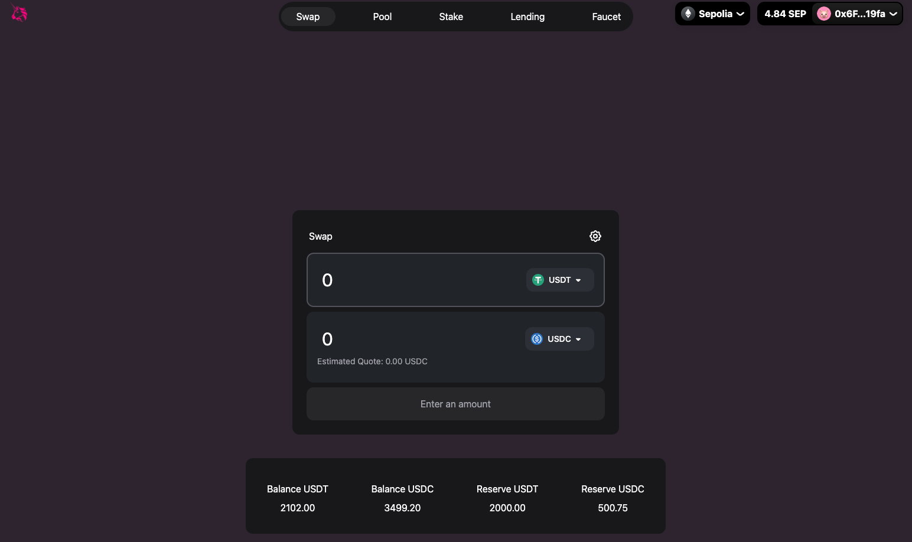

# DeFi Suite

**DeFi Suite** is a collection of Solidity smart contracts that power various decentralized finance (DeFi) features, including token swapping, liquidity provision, staking, lending, borrowing, and more.

## Table of Contents

- [DeFi Suite](#defi-suite)
  - [Table of Contents](#table-of-contents)
  - [Introduction](#introduction)
  - [Contracts](#contracts)
    - [1. SwapRouter.sol](#1-swaproutersol)
    - [2. StakingPoolRouter.sol](#2-stakingpoolroutersol)
    - [3. LendingPoolRouter.sol](#3-lendingpoolroutersol)
  - [Features](#features)
  - [Getting Started](#getting-started)
  - [Usage](#usage)
  - [Contributing](#contributing)
  - [License](#license)

## Introduction

DeFi Suite comprises a set of smart contracts that enable decentralized finance operations, offering a range of functionalities and services for users in the DeFi ecosystem. These contracts are designed to be flexible, efficient, and secure.

## Contracts

### 1. SwapRouter.sol

**Description**: SwapRouter is a Solidity smart contract that facilitates token swapping and liquidity provision on decentralized exchanges.

- [Link to Contract](hardhat/contracts/router/SwapRouter.sol)
- [Link to Interface](hardhat/contracts/interfaces/ISwapRouter.sol)

### 2. StakingPoolRouter.sol

**Description**: StakingPoolRouter is a Solidity smart contract that interacts with staking pools, allowing users to stake, unstake, and claim rewards.

- [Link to Contract](hardhat/contracts/StakingPoolRouter.sol)
- [Link to Interface](hardhat/contracts/interfaces/IStakingPoolRouter.sol)

### 3. LendingPoolRouter.sol

**Description**: LendingPoolRouter is a Solidity smart contract designed for lending and borrowing tokens, both ERC-20 and Ether (via Wrapped Ether or WETH).

- [Link to Contract](hardhat/contracts/LendingPoolRouter.sol)
- [Link to Interface](hardhat/contracts/interfaces/ILendingPoolRouter.sol)

## Features

- **Swap Tokens**: Swap tokens using SwapRouter.
- **Stake Tokens**: Stake tokens and earn rewards using StakingPoolRouter.
- **Lend and Borrow**: Lend and borrow tokens, including Ether, using LendingPoolRouter.

## Getting Started

To begin using the contracts, follow these steps:

1. Clone by using `git https://github.com/0xhaz/Uniswap-DEX.git`
2. Use `yarn install` to install all the components in package.json
3. To deploy using local network, you can use `yarn hardhat run`
4. To deploy using testnet, you can use `yarn hardhat deploy --network sepolia`.
5. All contract address and ABI's are copied automatically using node.js scripts.

## Usage

To use these contracts, follow the steps outlined in the "Getting Started" section above. Interact with the contract functions to participate in staking, lending and swapping a tokens. Make sure to follow the rules and requirements for each contract's functionalities.

## Contributing

Contributions to this project are welcome! If you find any issues or have ideas for improvement, feel free to open an issue or submit a pull request.

## License

This project is licensed under the [License Name] License - see the [LICENSE.md](LICENSE.md) file for details.
